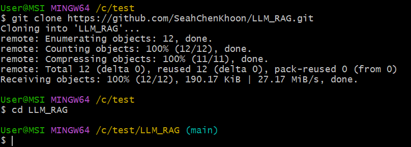
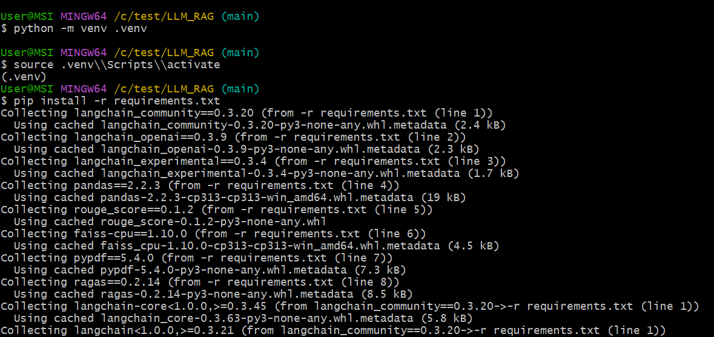
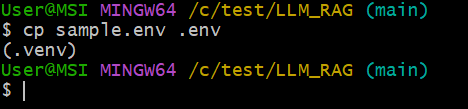
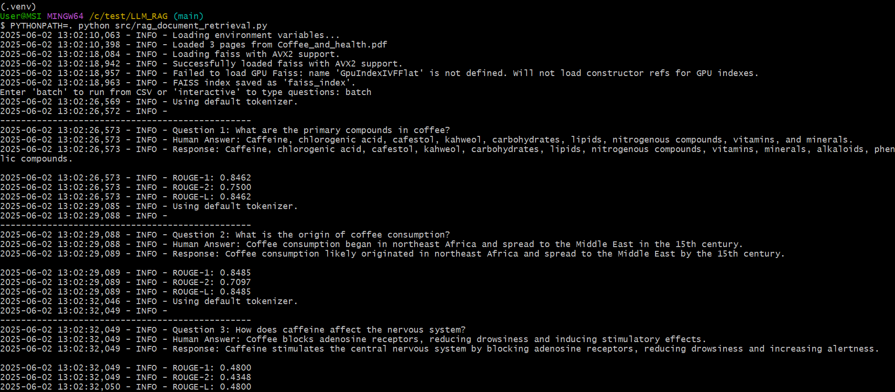
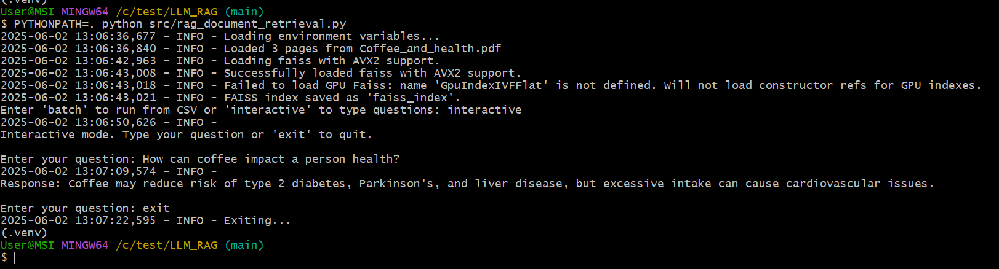

# Retrieval-Augmented Generation Evaluation Pipeline

A document-grounded question answering system with LangChain + OpenAI that evaluates generated responses using both ROUGE and RAGAS metrics.

---

## 🧠 Project Overview

This pipeline ingests PDFs, splits them semantically, stores them in a FAISS vector store with OpenAI embeddings, and answers questions using a Retrieval-Augmented Generation (RAG) chain. It supports both batch evaluation and interactive querying, and provides automatic scoring using ROUGE and RAGAS.

**Use cases:**
- Evaluating QA system performance on domain-specific documents
- Benchmarking retrieval quality and answer faithfulness
- Running both automated and human-in-the-loop evaluations

---
## 🔧 Features

- 📄 PDF document loading via `PyPDFLoader`
- ✂️ Semantic chunking with `SemanticChunker`
- 🧠 RAG chain using `ChatOpenAI` and `RetrievalQA`
- 📊 ROUGE and RAGAS scoring
- 🧪 Batch mode with CSV input/output
- 💬 Interactive mode with live querying
- 💾 FAISS index persistence

---

## 📁 Project Structure

```text
├── documents/                      # PDF documents to index
│   └── Coffee_and_health.pdf       # Sample PDF to RAG
├── questions/                      # CSV files with questions and ground 
│   └── Questions.csv               # Batch questions storage
├── results/                        # Output folder for evaluation results
│   └── result_20250324_1155.csv    # Example result file
├── src/
│   ├── cls_Env.py                  # Loads environment variables and config
│   ├── util.py                     # Config utility functions
│   ├── rag_document_retrieval.py   # RAG pipeline entry point for processing, QA, and evaluation
│   └── config.yml                  # Central YAML configuration file for paths, model, and runtime settings
├── .env                            # Environment variable file
├── requirements.txt                # Python dependencies
├── README.md                       # ReadMe file
```

## ⚙️ Setup
### 1. Clone and install

```bash
git clone https://github.com/SeahChenKhoon/LLM_RAG.git
cd LLM_RAG
```




### 2. Set Up Virtual Environment and Install Dependencies
This step may take a few minutes to complete.
```bash
python -m venv .venv
source .venv\\Scripts\\activate # On On macOS/Linux: source venv/bin/activate  
pip install -r requirements.txt
```




### 3. Configure environment
Copy .env_sample to .env and update as needed:
```bash
cp sample.env .env
```



| Variable             | Description                                             |
|----------------------|---------------------------------------------------------|
| `YAML_CONFIG_PATH`   | Path to the central YAML configuration file            |
| `OPENAI_API_KEY`     | Your OpenAI API key                                     |
| `OPENAI_MODEL_NAME`  | The OpenAI model used for inference (e.g., `gpt-4`)     |
| `LLM_TEMPERATURE`    | LLM response creativity and randomness (e.g., `0.2`)    |


## 🚀 Usage

### Batch Mode (from CSV)
```bash
  PYTHONPATH=. python src/rag_document_retrieval.py
```

When prompted:
Enter `batch` to run from CSV or `interactive` to type questions: `batch`



### Interactive Mode
```bash
  PYTHONPATH=. python src/rag_document_retrieval.py.py
```
When prompted:
Enter `batch` to run from CSV or `interactive` to type questions: `interactive`



## 📊 Metrics

- ROUGE-1, ROUGE-2, ROUGE-L: Lexical overlap
- RAGAS:
  - answer_relevancy
  - context_precision
  - context_recall
  - faithfulness
  - semantic_similarity

Results saved to a timestamped file, e.g.:
```text
results/result_20250602_1043.csv
```

## ✅ Requirements
- Python 3.8+
- langchain
- openai
- ragas
- datasets
- rouge_score
- python-dotenv
- pandas

